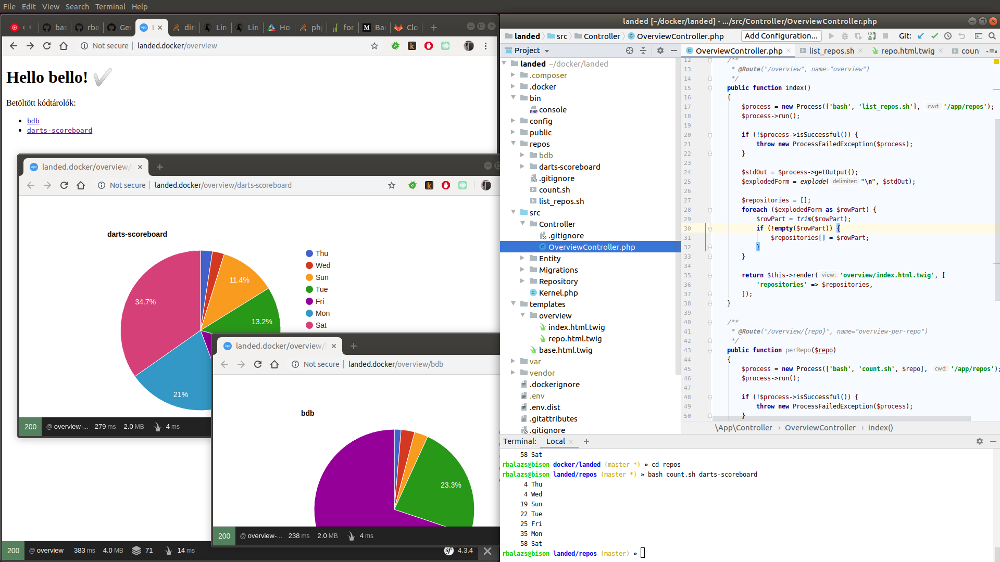

# Goal
Lets see the statistics of multiple git repositories on embeddable charts and diagrams.

## Setup the project
### Bootstrap the enviroment
#### scp env file
`scp .env.dist .env`
#### host file
`127.0.0.1       landed.docker`
#### docker env
`docker-compose up -d --build`

`docker-compose exec php composer install`

### Load up repositories
#### copy repository list, and set the urls
`scp repos/repo_list.json.dist repos/repo_list.json`

**_[Example](https://github.com/rbalazs/landed/blob/70711a3a8108d5e0cf27d62ece7ac2972b83711a/repos/repo_list.json.dist)_**
#### clone repositories
`cd repos && python clone_repos.py`

### Have a look
http://landed.docker/overview
